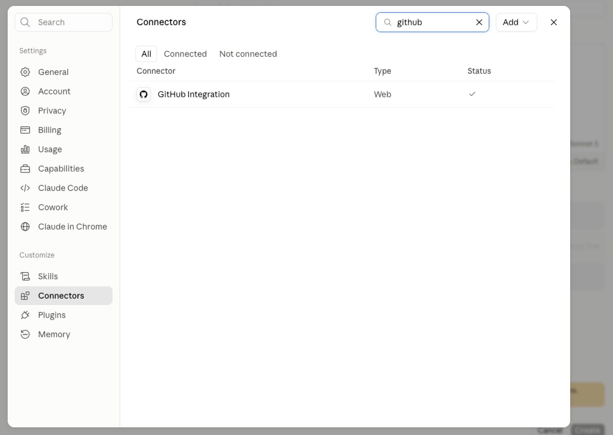
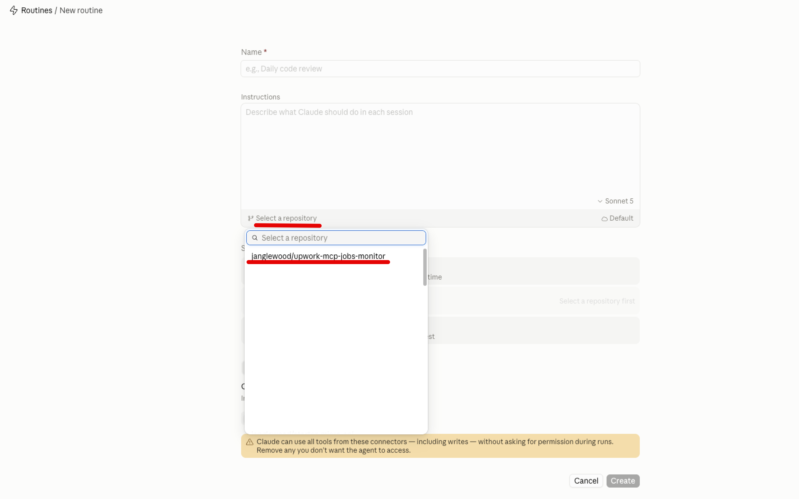
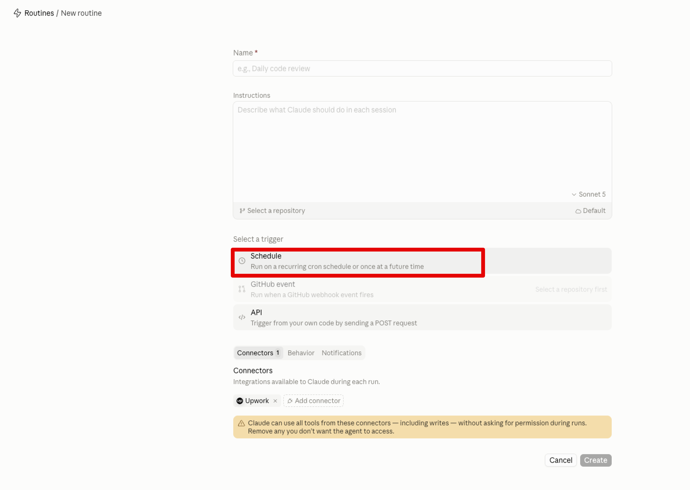
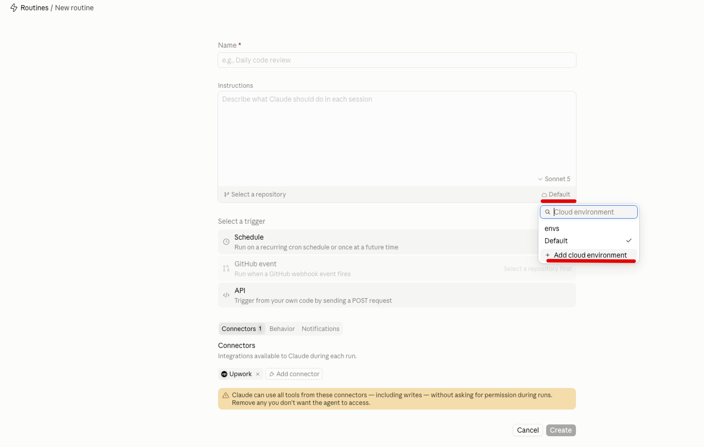
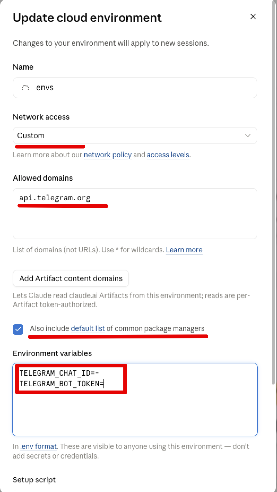
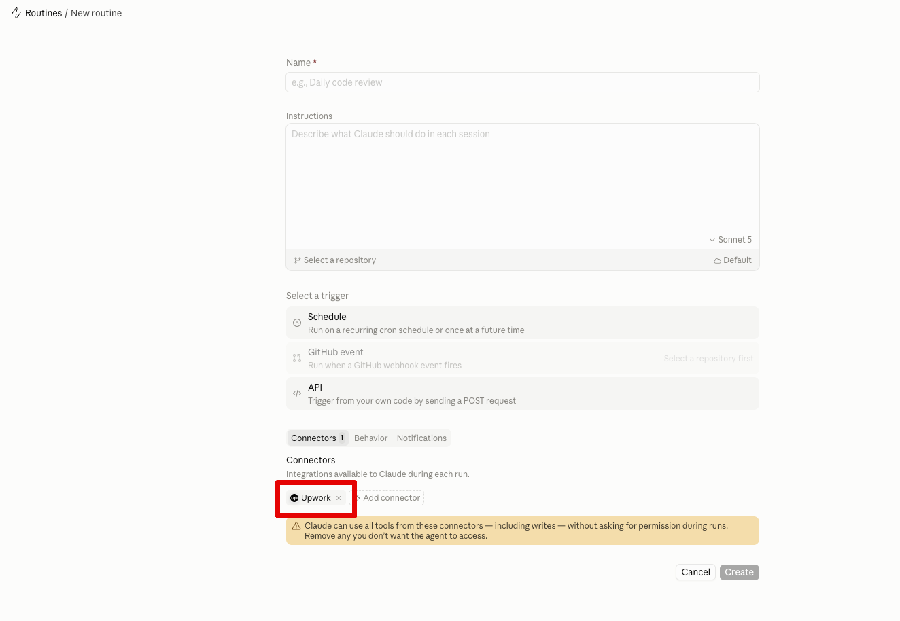
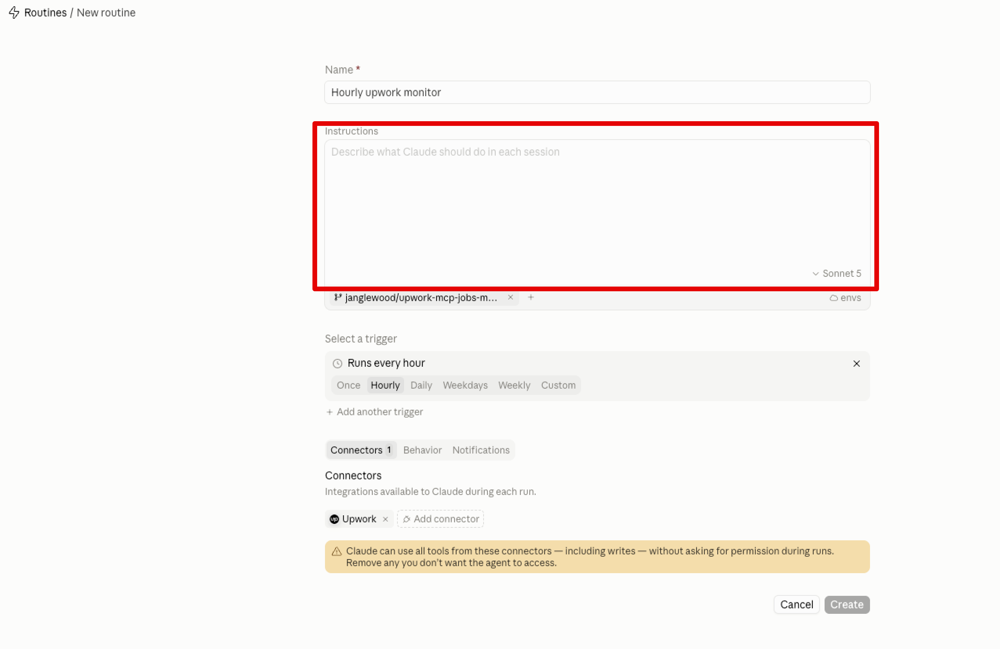
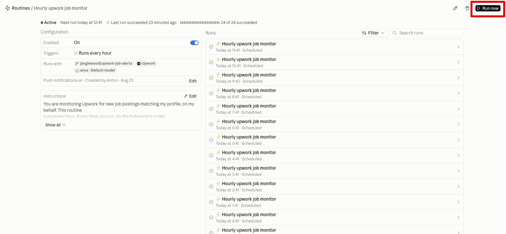

# Руководство по настройке

Пошаговая инструкция для запуска собственной копии монитора вакансий Upwork. Всё описанное здесь
работает на *вашей* подписке Claude, *вашем* коннекторе Upwork и *вашем* Telegram-боте — ничего не
разделяется с чужими настройками.

English version: [SETUP.md](SETUP.md)

## Что понадобится

- Подписка Claude с доступом к [Routines](https://claude.ai/code/routines) (маршрутам/рутинам).
- Аккаунт фрилансера на Upwork с более-менее заполненным профилем (навыки, ставка, описание,
  портфолио/история работ). Рутина читает его вживую при каждом запуске, чтобы оценивать
  соответствие вакансий и писать черновики откликов.
- Аккаунт GitHub — для вашего форка репозитория.
- Аккаунт Telegram — для бота, который будет присылать уведомления.

## 1. Сделайте форк репозитория

Сделайте форк в свой аккаунт GitHub. Именно в этом форке рутина будет читать `profile.md` и
`seen_jobs.json`, и коммитить обновлённое состояние после каждого запуска.

## 2. Подключите свой аккаунт Upwork к Claude

В Claude откройте Settings → Connectors и добавьте коннектор **Upwork**. Авторизуйте его на
собственном аккаунте Upwork. Именно это позволяет рутине вызывать `get_profile`, `find_jobs` и
`get_freelancer_dashboard` от вашего имени — она никогда не трогает чужой аккаунт и никогда не
отправляет отклики и не откликается на вакансии; только читает данные.

## 3. Создайте Telegram-бота и узнайте свой chat ID

1. Откройте чат с [@BotFather](https://t.me/BotFather) в Telegram, отправьте `/newbot` и следуйте
   подсказкам. В ответ вы получите **токен бота** — что-то вроде
   `123456789:AAExampleTokenText`.
2. Отправьте своему новому боту любое сообщение (найдите его по указанному вами username и
   нажмите Start).
3. Узнайте свой **chat ID**: откройте в браузере
   `https://api.telegram.org/bot<ВАШ_ТОКЕН_БОТА>/getUpdates` (подставив свой реальный токен вместо
   `<ВАШ_ТОКЕН_БОТА>`) после того как отправили боту сообщение. В ответе найдите
   `"chat":{"id":...}` — это число и есть ваш chat ID.

Сохраните токен бота и chat ID — они понадобятся на следующем шаге.

## 4. Подключите GitHub к Claude

Рутины читают и записывают файлы репозитория через отдельный коннектор GitHub — не через тот же,
что и Upwork:

1. В Claude откройте Settings → Connectors и добавьте коннектор **GitHub**.
2. Авторизуйте GitHub App и выберите доступ к репозиториям — «Only select repositories» и укажите
   свой форк (или «All repositories», если удобнее). Именно это позволяет рутине видеть ваш форк в
   выборе репозитория и коммитить обновления `seen_jobs.json` в `main`.

## 5. Создайте рутину

В интерфейсе Routines в Claude:

1. [Создайте новую рутину](https://claude.ai/code/routines) и выберите свой форк в выборе
   репозитория.

   

2. Установите расписание — раз в час.

   

3. Добавьте два секрета / переменные окружения для рутины:
   - `TELEGRAM_BOT_TOKEN` — токен из шага 3.
   - `TELEGRAM_CHAT_ID` — chat ID из шага 3.

   

   

4. Убедитесь, что для этой рутины включён коннектор **Upwork MCP**.

   

5. Вставьте полное содержимое файла [`ROUTINE_PROMPT.md`](../ROUTINE_PROMPT.md) как промпт рутины
   — можно использовать как есть, а можно поменять что-то под себя, если хочется.

   

6. Сохраните и включите рутину.

   

## 6. Настройте `profile.md`

Навыки, ставка и портфолио подтягиваются вживую из вашего профиля Upwork — дублировать их не
нужно. Редактируйте `profile.md` в своём форке только для того, что API Upwork передать не может:

- **Чего избегать** — например, минимальная ставка в час, типы работ, которые вам не интересны,
  тревожные признаки у клиентов.
- **Тон** — как должны звучать черновики откликов.
- **Переопределения (overrides)** — только если ваш живой профиль Upwork вводит в заблуждение при
  оценке соответствия (например, указан навык, по которому вы на самом деле не хотите работать).

Закоммитьте и запушьте эти изменения в `main` до первого запуска.

## 7. Что происходит при первом запуске

При самом первом запуске рутины `seen_jobs.json` пуст, поэтому этот запуск считается
**сидирующим (seeding run)**: рутина получает список актуальных подходящих вакансий, помечает все
их ID как уже просмотренные и коммитит это — без оценки, черновиков и уведомлений в Telegram. Так
сделано специально, чтобы вас не завалило уведомлениями по всем вакансиям, которые уже существовали
до включения рутины. Начиная со следующего запуска уведомления приходят только по-настоящему новым
вакансиям.

## Решение проблем

- **Нет сообщений в Telegram после первого (сидирующего) запуска**: проверьте, что токен бота и
  chat ID верно указаны в секретах рутины, и что вы уже отправляли боту хотя бы одно сообщение
  (боты Telegram не могут писать вам, пока вы не написали им первыми).
- **Слишком много нерелевантных уведомлений**: ужесточите раздел «Чего избегать» в `profile.md`.
- **Слишком мало уведомлений**: ослабьте «Чего избегать» или проверьте, что навыки в вашем профиле
  Upwork достаточно широкие, чтобы совпадать с нужными вакансиями.
- **Коммиты не появляются в вашем форке**: убедитесь, что у рутины есть права на запись в
  репозиторий.

## О безопасности

Эта рутина только читает ваш профиль Upwork и подходящие вакансии, читает/пишет файлы в вашем
собственном форке и отправляет сообщения в Telegram. Она никогда не отправляет отклик, не
сохраняет вакансию и не откликается на неё через коннектор — вы всегда откликаетесь сами, прочитав
уведомление.
